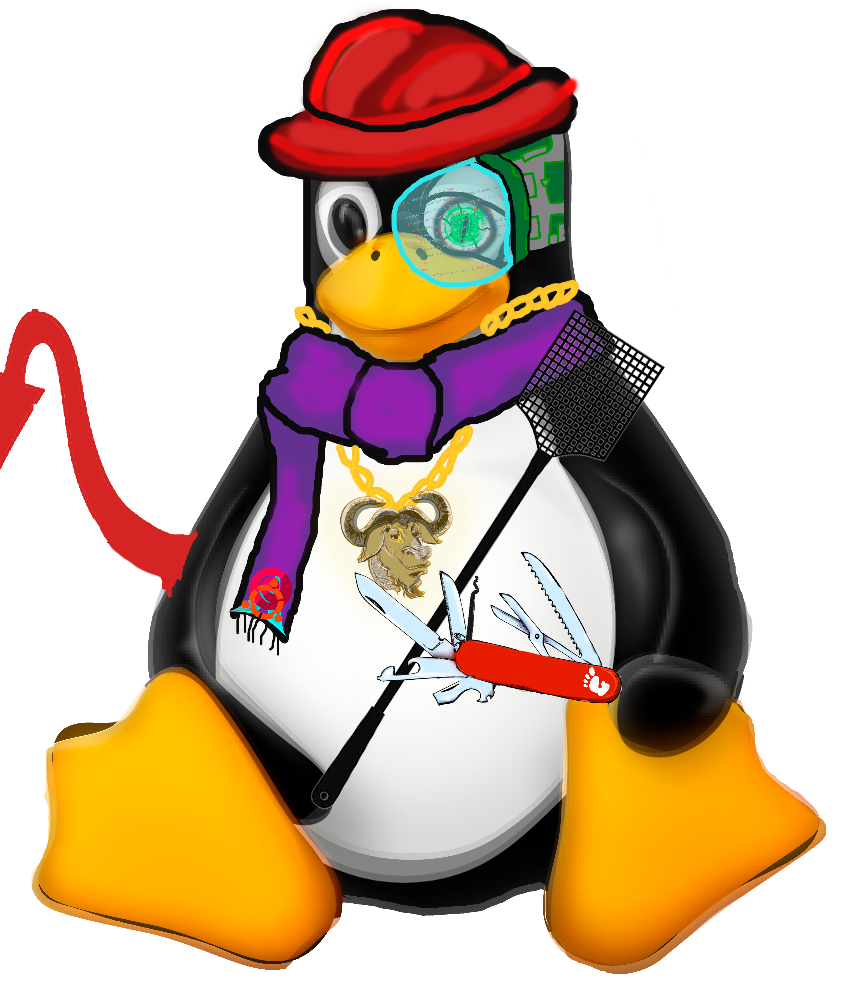
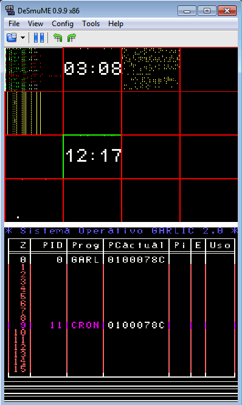
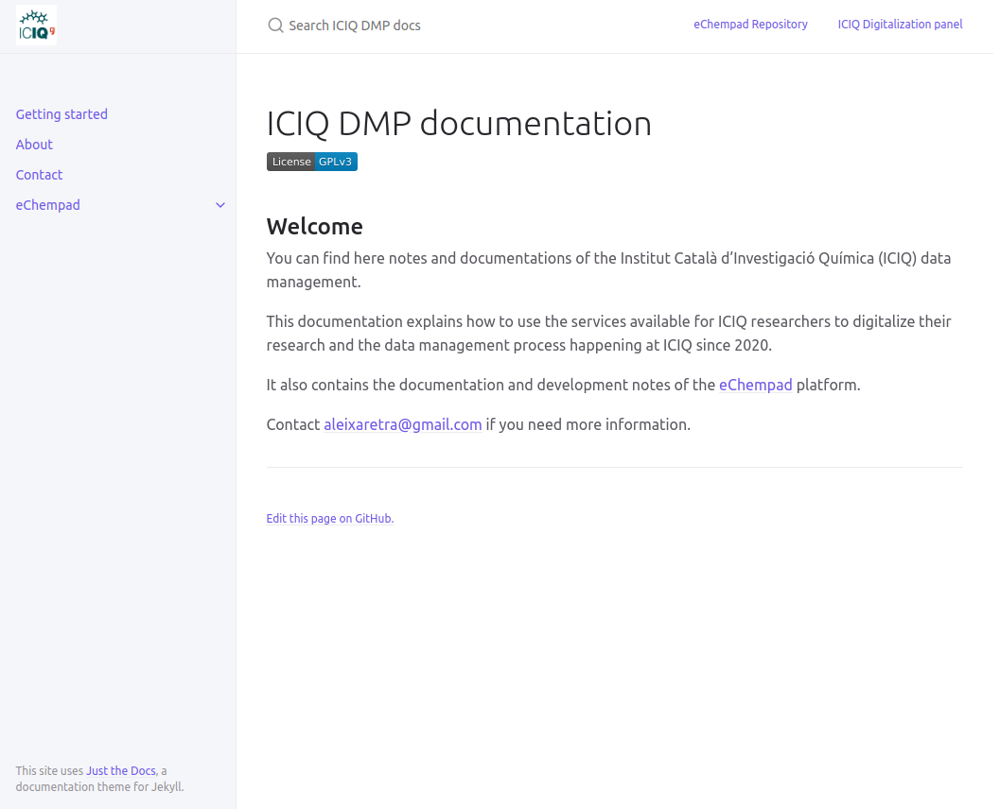
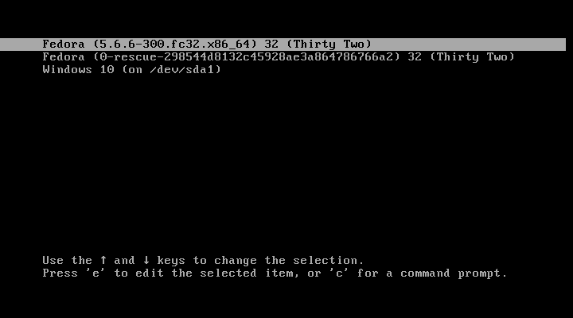

<!-- align="center" works in markdown, even if it is deprecated in HTML, so suppress warning -->
<!--suppress HtmlDeprecatedAttribute -->

<!-- Remember that blank lines and indentation when working with markdown / HTML are used in parsing -->
<!-- This file was partly generated with this tool https://rahuldkjain.github.io/gh-profile-readme-generator/
If you want to copy me that is a good place to start-->
<!-- For the publication badges I used this https://zenodo.org/badge/DOI/10.1073/pnas.2303887120.svg -->

<!-- Title -->
<h3 align="center">A scientist & engineer working as full-stack developer & data steward</h3>

<!-- Eliot Alderson + profile visits counter -->

    <table>
	    <tr>
    	    <td style="padding:10px">
                
      	    </td>
            <td style="padding:10px">
                
            </td>
        </tr>
    </table>

<!-- User status -->
 
<h3 align="center"> 📁 Check out <a href="https://aleixmt.github.io" target="blank"> my portfolio</a>! (WIP)</h3>	
 

<!-- Social media -->
<h3 align="center">Connect with me:</h3>
    

        
        
        
        
        
        
        
        
    

<!-- Support and donations -->
<h3 align="center">Support:</h3>

    

    

  

<!-- My projects -->

	

		💼 My projects: 
	

	 
	

		

			Linux Auto Customizer
		
 
		

		  
		

		

		  <a href="https://github.com/Gua-tk/Linux-Auto-Customizer">Repository</a>
		

		<i> May 2019 - Present </i>
        <ul>
            <li>Utility to automate, manage and maintain installations and customizations across all you Linux machines.</li>
            <li>Contains almost 300 pre-coded installations and customizations that you can use <i>out-of-the-box.</i></li>
            <li>Compatibility with Windows through <a href="https://learn.microsoft.com/en-us/windows/wsl/install">WSL2</a> and <a href="https://git-scm.com/downloads">git bash</a>.</li>
            <li>Compatibility with Android through <a href="https://f-droid.org/en/packages/com.termux/">Termux.</a></li>
            <li><a href="https://github.com/Gua-tk/Linux-Auto-Customizer/wiki/Getting-started">Check out how to start using it</a> or <a href="https://github.com/Gua-tk/Linux-Auto-Customizer/blob/master/doc/FEATURES.md">check the installations that are already implemented</a>.</li>
        </ul>
        <h5 align="center"> 
              
            Used technologies:
              
             
            
        </h5>
	

    

    

        eChempad
    

    

        
    

    

    <a href="https://github.com/ICIQ-DMP/eChempad-public-mirror">Repository</a>
    

    <i> September 2021 - Present </i>
    <ul>
        <li>Web platform to manage the life-cycle of data from experimental chemistry at <a href="https://www.iciq.org/"><i>Institut Català d'Investigació Química</i> (ICIQ)</a>.</li>
        <li>It currently allows the import of data from <a href="https://www.perkinelmer.com/libraries/sht_perkinelmer-signals-notebook-013433_01">Perkin-Elmer Signals notebook</a> and the export of this data into the <a href="https://dataverse.org/">Dataverse</a> of <a href="https://dataverse.csuc.cat/">CORA RDR</a>.</li>
        <li>Check out <a href="https://iciq-dmp.github.io/">the documentation</a> to get started.</li>
    </ul>
    <h5 align="center">   Used technologies:   
     
     
     
     
    
     
     
    
    
     
    
     
     
     
    
     
     
    
     
    </h5>	
    

    

    

        Problemas Computadores
    

    

        
    

    

    <a href="https://github.com/vidwise/Problemas-Computadores">Repository</a>
    

    <i> January 2022 - Present </i>
    <ul>
        <li>Repository for the solutions of the problems from the subject <i>Computers</i> of the degree of <i>Computer Science</i> from the <a href="https://www.urv.cat/"><i>Universitat Rovira i Virgili</i> (URV)</a>.</li>
        <li>These problems are exercises of programming in the C language and assembly ARM in which one or more peripheral devices need to be synced with the CPUs of the Nintendo DS using interruptions or other synchronization mechanisms.</li>
        <li>This project was developed originally for my freelance teaching lessons in this subject, but it ended up as a collaboration with the teachers <a href="https://github.com/AreyFerreroRamos">@AreyFerreroRamos</a> and <a href="https://github.com/annaju128">@annaju128</a> and with some students that contributed with their solutions.</li>
        <li>Currently, at 14/03/2024, we have 39 problems, which 15 have been fully solved by the subject's teacher and 10 have been solved by us with different levels of completion.</li>
    </ul>
    <h5 align="center">   Used technologies:  
    
    
    
    
    
     
    </h5>	
    

    

    

        GarlicOS
    

    

        
    

    

    <a href="https://github.com/URV-BioGEI/GarlicOS">Repository</a>
    

    <i> August 2017 - January 2018 </i>
    <ul>
        <li>Functional operating system for Nintendo DS developed as exercise for the subject <i>Operating Systems Structure</i> from the degree of <i>Computer Science</i> of <a href="https://www.urv.cat/"><i>Universitat Rovira i Virgili</i> (URV)</a>.</li>
        <li>Developed using the C programming language and ARM assembly.</li>
        <li>The system can execute binary programs and offers an API of functions to access different hardware and system resources from the programs such as memory management, virtual keyboard, graphical window navigation and process multiplexing.</li>
        <li>First phase of development is completed in the branch <i>fase1</i> with the parts of all programmers (processes, graphics, memory and keyboard).</li>
        <li>Second phase of development is in the branch <i>fase2</i> with the parts of programmers of processes, graphics and keyboard.</li>
        <li>I am looking for help to merge the part of the memory programmer into phase 2 to end the project.</li>
    </ul>
    <h5 align="center">   Used technologies:  
    
    
    
     
    </h5>	
    

    

    

        ICIQ-DMP.github.io
    

    

        
    

    

    <a href="https://github.com/ICIQ-DMP/ICIQ-DMP-github.io">Repository</a>
    

    

    <a href="https://ICIQ-DMP-github.io">Web page</a>
    

    <i> September 2022 - Present </i>
    <ul>
        <li>Documentation page for the whole project of digitalization at <a href="https://www.iciq.org/"><i>ICIQ</i></a>.</li>
        <li>Contains documentation regarding the usage of eChempad project, the eChempad production server, the data 
            management lifecycle of experiments at ICIQ and the specification of data schemes in Dataverse / CORA RDR 
            and Perkin-Elmer Signals Notebook</li>
    </ul>
    <h5 align="center">   Used technologies:  
    
    
     
    
     
    
    
     
    </h5>	
    

    

    

        home-server
    

    

        
    

    

    <a href="https://github.com/AleixMT/home-server">Repository</a>
    

    <i> August 2022 - Present </i>
    <ul>
        <li>Documentation repository for the configuration of a custom home media server.</li>
        <li>It mainly contains a wiki that explains the different steps to follow when configuring certain features 
            and components of a home server</li>
        <li>It also contains configurations, scripts, Dockerfiles and other resources to set up the home server.</li>
        <li>This configuration for a home server features multiple boot with Windows and other systems, a VPN with 
            OpenVPN to access
            the web services from any part of the world safely, a configuration of a file-sharing service such as Samba 
            , a WoLAN service to switch on the server from any part of the world, SSH access, an automatic monitoring 
            and download of movies and series using Jackett + Radarr + Sonarr + Transmission and a home page to access
            all your home web services.</li>
    </ul>
    <h5 align="center">   Used technologies:  
    
    
    
    
    
    
     
     
    
     
    </h5>	
    

 

<!-- Technical skills -->

	👩🏾‍💻 My technology stacks:

     
    

    

        🤓 Technologies that I know:
    

     
    All categories by descending order of knowledge:
    <h5 align="center">Programming languages:</h5>
    
 
         
         
         
         
         
         
         
    

    <h5 align="center">Markup languages:</h5>
    
 
         
        
        <a href="https://yaml.org/" target="_blank" rel="noreferrer">
            <picture>
                <source media="(prefers-color-scheme: dark)" srcset="https://raw.githubusercontent.com/AleixMT/AleixMT/master/.github/img/yaml_w.png">
		<source media="(prefers-color-scheme: light)" srcset="https://raw.githubusercontent.com/AleixMT/AleixMT/master/.github/img/yaml_b.png">
                 
            </picture>
        </a>
        <a href="https://www.latex-project.org/" target="_blank" rel="noreferrer">
	    <picture>
                <source media="(prefers-color-scheme: dark)" srcset="https://raw.githubusercontent.com/AleixMT/AleixMT/master/.github/img/LaTeX_w.png">
		<source media="(prefers-color-scheme: light)" srcset="https://raw.githubusercontent.com/AleixMT/AleixMT/master/.github/img/LaTeX.png">
                 
            </picture>
	</a>
        
        
    

    <h5 align="center">Frameworks:</h5>
    
 
        <a href="https://getbootstrap.com" target="_blank" rel="noreferrer"> 
	    <picture>
                <source media="(prefers-color-scheme: dark)" srcset="https://raw.githubusercontent.com/AleixMT/AleixMT/master/.github/img/bootstrap_w.png">
		<source media="(prefers-color-scheme: light)" srcset="https://raw.githubusercontent.com/AleixMT/AleixMT/master/.github/img/bootstrap.svg">
                 
            </picture>
	</a> 
         
         
         
    

    <h5 align="center">Databases:</h5>
    
 
        
         
         
    

    <h5 align="center">Operating Systems:</h5>
    
 
         
         
         
         
         
    

    <h5 align="center">Platforms and hardware:</h5>
    
 
        <a href="https://www.nintendo.es/Nintendo-DS/Gama-de-consolas-Nintendo-DS-Pagina-web-oficial-de-Nintendo-Iberica-Nintendo-DS-Nintendo-DSi-Nintendo-DSi-XL-116380.html" target="_blank" rel="noreferrer"> 
	    <picture>
                <source media="(prefers-color-scheme: dark)" srcset="https://raw.githubusercontent.com/AleixMT/AleixMT/master/.github/img/NDS_w.png">
		<source media="(prefers-color-scheme: light)" srcset="https://raw.githubusercontent.com/AleixMT/AleixMT/master/.github/img/NDS.png">
                 
            </picture>
	</a> 
         
        <a href="https://en.wikipedia.org/wiki/Nintendo_3DS" target="_blank" rel="noreferrer">
	    <picture>
                <source media="(prefers-color-scheme: dark)" srcset="https://raw.githubusercontent.com/AleixMT/AleixMT/master/.github/img/3DS_w.png">
		<source media="(prefers-color-scheme: light)" srcset="https://raw.githubusercontent.com/AleixMT/AleixMT/master/.github/img/3DS.png">
                 
            </picture>
	</a> 
         
         
    

    <h5 align="center">DevOps:</h5>
    
 
         
         
        <a href="https://www.github.com" target="_blank" rel="noreferrer">
	    <picture>
                <source media="(prefers-color-scheme: dark)" srcset="https://raw.githubusercontent.com/AleixMT/AleixMT/master/.github/img/github_actions_w.png">
		<source media="(prefers-color-scheme: light)" srcset="https://raw.githubusercontent.com/AleixMT/AleixMT/master/.github/img/github-actions.svg">
                 
            </picture>
	</a>
        
        
        
        <a href="https://railway.app/" target="_blank" rel="noreferrer">
	    <picture>
                <source media="(prefers-color-scheme: dark)" srcset="https://raw.githubusercontent.com/AleixMT/AleixMT/master/.github/img/railway_w.png">
		<source media="(prefers-color-scheme: light)" srcset="https://raw.githubusercontent.com/AleixMT/AleixMT/master/.github/img/railway.svg">
                 
            </picture>
	</a>
        <a href="https://vercel.com/" target="_blank" rel="noreferrer"> 
	    <picture>
                <source media="(prefers-color-scheme: dark)" srcset="https://raw.githubusercontent.com/AleixMT/AleixMT/master/.github/img/vercel_w.png">
		<source media="(prefers-color-scheme: light)" srcset="https://raw.githubusercontent.com/AleixMT/AleixMT/master/.github/img/vercel.svg">
                 
            </picture>
	</a>
    

    <h5 align="center">Tools:</h5>
    
 
         
         
         
        <a href="https://maven.apache.org/" target="_blank" rel="noreferrer">
	    <picture>
                <source media="(prefers-color-scheme: dark)" srcset="https://raw.githubusercontent.com/AleixMT/AleixMT/master/.github/img/maven_w.png">
		<source media="(prefers-color-scheme: light)" srcset="https://raw.githubusercontent.com/AleixMT/AleixMT/master/.github/img/maven.svg">
                 
            </picture>
	</a> 
         
        
        
        <a href="https://www.freedesktop.org/wiki/" target="_blank" rel="noreferrer">
	    <picture>
                <source media="(prefers-color-scheme: dark)" srcset="https://raw.githubusercontent.com/AleixMT/AleixMT/master/.github/img/freedesktop_w.png">
		<source media="(prefers-color-scheme: light)" srcset="https://raw.githubusercontent.com/AleixMT/AleixMT/master/.github/img/freedesktop.svg">
                 
            </picture>
	</a>
    

    <h5 align="center">Cloud & serverless:</h5>
    
 
         
    
 
    

    

    

        🤔 Technologies that I have worked with:
        

         
        All categories by descending order of knowledge:
        <h5 align="center">Programming languages:</h5>
        
 
             
             
             
            
             
             
             
             
             
        

        <h5 align="center">Frameworks:</h5>
        
 
             
             
             
             
             
             
             
        

        <h5 align="center">Databases:</h5>
        
 
             
             
            
            <a href="https://www.elastic.co/" target="_blank" rel="noreferrer"> 
		<picture>
	                <source media="(prefers-color-scheme: dark)" srcset="https://raw.githubusercontent.com/AleixMT/AleixMT/master/.github/img/elastic_w.png">
			<source media="(prefers-color-scheme: light)" srcset="https://raw.githubusercontent.com/AleixMT/AleixMT/master/.github/img/elasticsearch.png">
	                 
            	</picture>
	    </a>
        

        <h5 align="center">Operating Systems:</h5>
        
 
            <a href="https://www.debian.org/" target="_blank" rel="noreferrer">  
	    	<picture>
	                <source media="(prefers-color-scheme: dark)" srcset="https://raw.githubusercontent.com/AleixMT/AleixMT/master/.github/img/debian_w.png">
			<source media="(prefers-color-scheme: light)" srcset="https://raw.githubusercontent.com/AleixMT/AleixMT/master/.github/img/debian.png">
	                 
            	</picture>
	    </a> 
        

        <h5 align="center">Platforms and hardware:</h5>
        
 
             
        

        <h5 align="center">DevOps:</h5>
        
 
             
        

        <h5 align="center">Tools:</h5>
        
 
             
        

        <h5 align="center">Cloud & serverless:</h5>
        
 
             
        

    

 

<!-- Organizations -->

    

        🏘 My organizations:
    

     
    

        

            Association of Biotechnologists of Catalonia (ASBTEC)
        

        

            
        

        

            <a href="https://github.com/ASBTEC">github.com/ASBTEC</a>
        

        

            <a href="https://ASBTEC.cat/">ASBTEC.cat</a>
        

        <ul>
            <li>
                ASBTEC is a non-profit organization formed by professionals and students in Biotechnology.
            </li> 
            <li>
                ASBTEC is the entity of reference for professionals and students of Biotechnology in Catalonia, capable 
                of gathering and energizing all this human potential to donate money to a collaborative group for 
                Biotechnology and for Biotechnology.
            </li>
            <li>
                ASBTEC has the mission of promoting the figure of Biotechnology and Biotechnology among the different 
                actors in the sector (administration, employers and society), ensuring quality and continuous training 
                for Biotechnology, creating a space that facilitates the exchange of ideas, projects and promote the 
                development of a collaborative group both nationally and internationally.
            </li>
            <li>
                This GitHub organization is used to store all the files related to programming projects in ASBTEC, 
                such as the R course.
            </li>
            <li>
                Currently, I am part of the <a href="https://asbtec.cat/quisom/junta-directiva/">board of directors</a> 
                of this organization, in which I am the informatics responsible.
            </li>
            <li>
                As the informatics responsible my responsibilities were maintaining our web page made with Wordpress, 
                solve problems that users may have and take care of internal projects such as the migration of email 
                accounts to the Google Suite or the automatic creation of email signatures for the board of directors.
            </li>
        </ul>	
    

    

        

            Equipaments Hosteleria Salou (EHS)
        

        

            
        

        

            <a href="https://github.com/Equipaments-Hosteleria-Salou">github.com/Equipaments-Hosteleria-Salou</a>
        

        

            <a href="https://www.menajeymas.com/es/equipaments-hosteleria-salou">menajeymas.com</a>
        

        <ul>
            <li>
                Equipaments Hosteleria Salou is an enterprise established in Salou and Vila-Seca specialized in high 
                quality hostelry.  
            </li>
            <li>
                Equipaments Hosteleria Salou is the official supplier of hostelry material in the province of 
                Tarragona. Its clients are hotels, taverns, schools, hospitals, restaurants and similar types of 
                business throughout the province.
            </li>
            <li>
                It also does sell to individuals through both physical and online shops.
            </li>
            <li>
                During the pandemic Equipaments Hosteleria Salou suffered a ransomware attack that required disaster 
                mitigation and forced to change drastically its computer infrastructure to increase its security. I 
                performed the required actions to recover the data and restore the service of its computer 
                infrastructure as soon as possible and with the minimum friction possible for the users. 
            </li>
            <li>
                This GitHub organization contains projects to administer the Windows machines of this business and 
                also some automated functionalities that the employees may need. 
            </li>
        </ul>	
    

    

        

            Gua-tk software
        

        

            
        

        

            <a href="https://github.com/Gua-tk">github.com/Gua-tk</a>
        

        <ul>
            <li>
                Gua-tk is an organization created to store all the projects that are related to the 
                Linux-Auto-Customizer software, which is my main open-source project.
            </li>
            <li>
                The main repository of the organization is the <a href="https://github.com/Gua-tk/Linux-Auto-Customizer">Linux-Auto-Customizer project</a>.
                You can take a look to the details of this project in 
                <a href="#project_Linux-Auto-Customizer">this section</a> of this readme.
            </li>
            <li>
                It contains different repositories that are related with the Linux-Auto-Customizer project in some way.
            </li>
            <li>
                For example, we have the <a href="https://github.com/Gua-tk/converters">converters project</a>, which 
                ended up as an installable feature in the Linux-Auto-Customizer software.
            </li>
            <li>
                We also have the <a href="https://github.com/Gua-tk/Wallpapers">wallpaper project</a>, which 
                is used to store the wallpapers for the "wallpapers" feature from the Linux-Auto-Customizer software.
            </li>
        </ul>	
    

     

<!-- Profile stats -->

    

        📈 Profile stats:
    

    <!-- User stats -->
    <!-- Trophies -->
    
 
         

    <!-- Most used languages -->
    

        
    

    <!-- GitHub stats -->
    
&nbsp;
        
    

    <!-- Streak -->
    

        
    

<!-- Publications -->

    

        📚 Publications:
    

     
    

        

            Hyperedge prediction and the statistical mechanisms of higher-order and lower-order interactions in complex networks
        

         
        <i>Sales-Pardo, M., Mariné-Tena, A., & Guimerà, R.</i> (2023). <b>Hyperedge prediction and the statistical mechanisms of higher-order and lower-order interactions in complex networks</b>. In Proceedings of the National Academy of Sciences (Vol. 120, Issue 50). Proceedings of the National Academy of Sciences.
         
        
         
        <a href=""><i><b>🚫 Full text not available</b></i></a>
    

    

        

            e-PEMICU: an e-Health Platform to Support Early Mobilisation in Intensive Care Units
        

         
        <i>Martinez-Balleste, A., Gimeno, P., Marine, A., Batista, E., & Solanas, A.</i> (2019). <b>e-PEMICU: an e-Health Platform to Support Early Mobilisation in Intensive Care Units</b>. En 2019 10th International Conference on Information, Intelligence, Systems and Applications (IISA). 2019 10th International Conference on Information, Intelligence, Systems and Applications (IISA). IEEE.
         
        
         
        <a href="https://raw.githubusercontent.com/AleixMT/AleixMT/master/.github/publications/Publication_e-PEMICU.pdf"><i><b>⬇️ Download full text</b></i></a>
    

     

<!-- Publications -->

    

        🤝 Open-source collaborations:
    

     
    

        

            <b>Overload method void uploadFile(String doi, File file); to void uploadFile(String doi, InputStream is, String filename)</b> in <a href="https://github.com/IQSS/dataverse-client-java">IQSS/dataverse-client-java</a>
        

        <ul>
          <li><i>Summary</i>: Overload a library method to be able to supply data to it without needing to use a file on disk.</li>
          <li><i>Status</i>: <b>Completed</b></li>
          <li><i>Issue</i>: <b><a href="https://github.com/IQSS/dataverse-client-java/issues/12">#12</a></b></li>
          <li><i>Pull Request</i>: <b><a href="https://github.com/IQSS/dataverse-client-java/pull/13">✅ #13</a></b></li>
        </ul>
    

    

        

            <b>public Identifier createDataset(String dataSetJson, String dataverseAlias) {...} returns a DB identifier but we need a doi to uploadFile</b> in <a href="https://github.com/IQSS/dataverse-client-java">IQSS/dataverse-client-java</a>
        

        <ul>
          <li><i>Summary</i>: Make <i>createDataset</i> return a DOI of the created dataset.</li>
          <li><i>Status</i>: <b>Completed</b></li>
          <li><i>Issue</i>: <b><a href="https://github.com/IQSS/dataverse-client-java/issues/14">#14</a></b></li>
          <li><i>Pull Request</i>: <b><a href="https://github.com/IQSS/dataverse-client-java/pull/23">✅ #23</a></b></li>
        </ul>
    

    

        

            <b>Cannot retrieve any type of identifier from the files created with uploadFile method since it does not return any information of the created file</b> in <a href="https://github.com/IQSS/dataverse-client-java">IQSS/dataverse-client-java</a>
        

        <ul>
          <li><i>Summary</i>: Make <i>uploadFile</i> method return an id to the created file.</li>
          <li><i>Status</i>: <b>Completed</b></li>
          <li><i>Issue</i>: <b><a href="https://github.com/IQSS/dataverse-client-java/issues/16">#16</a></b></li>
          <li><i>Pull Request</i>: <b><a href="https://github.com/IQSS/dataverse-client-java/pull/23">✅ #23</a></b></li>
        </ul>
    

    

        

            <b>[FEATURE REQUEST] docker system prune --all or equivalent command to remove all docker data (containers, volumes, networks, images and cached layers) </b> in <a href="https://github.com/docker/roadmap">docker/roadmap</a>
        

        <ul>
          <li><i>Summary</i>: Create a new shortcut to reset the state of the docker engine (remove all containers, images, volumes and networks)</li>
          <li><i>Status</i>: <b>In progress</b></li>
          <li><i>Issue</i>: <b><a href="https://github.com/docker/roadmap/issues/617">#617</a></b></li>
          <li><i>Pull Request</i>: <b>❌ N/A</b></li>
        </ul>
    

<!-- Automatic blog post retrieval (GitHub action) -->
### 📋 Latest blog posts:
<!-- BLOG-POST-LIST:START -->
- [Display donut in the terminal](https://dev.to/aleixmt/display-donut-in-the-terminal-1c3f)
<!-- BLOG-POST-LIST:END -->

<!-- References -->
[customizer-repo]: http://github.com/Gua-tk/Linux-Auto-Customizer  "Official Linux-Auto-Customizer repository in GitHub"

