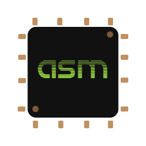

<!-- align="center" works in markdown, even if it is deprecated in HTML, so suppress warning -->
<!--suppress HtmlDeprecatedAttribute -->

<!-- Remember that blank lines and indentation when working with markdown / HTML are used in parsing -->
<!-- This file was partly generated with this tool https://rahuldkjain.github.io/gh-profile-readme-generator/
If you want to copy me that is a good place to start-->
<!-- For the publication badges I used this https://zenodo.org/badge/DOI/10.1073/pnas.2303887120.svg -->

<!-- Title -->
<h3 align="center">A scientist & engineer working as full-stack developer & data steward</h3>

<!-- Eliot Alderson + profile visits counter -->

    <table>
	    <tr>
    	    <td style="padding:10px">
                
      	    </td>
            <td style="padding:10px">
                
            </td>
        </tr>
    </table>

<!-- User status -->
 
<h3 align="center"> 📁 Check out <a href="https://aleixmt.github.io" target="blank"> my portfolio</a>! (WIP)</h3>	
 

<!-- Social media -->
<h3 align="center">Connect with me:</h3>
    

        
        
        
        
        
        
        
        
    

<!-- Support and donations -->
<h3 align="center">Support:</h3>

    

    

  

<!-- My projects -->

	

		💼 My projects: 
	

	 
	

		

			Linux Auto Customizer
		
 
		

		  
		

		

		  <a href="https://github.com/Gua-tk/Linux-Auto-Customizer">Official repo</a>
		

		<i> May 2019 - Present </i>
        <ul>
            <li>Utility to automate, manage and maintain installations and customizations across all you Linux machines.</li>
            <li>Contains almost 300 pre-coded installations and customizations that you can use <i>out-of-the-box.</i></li>
            <li>Compatibility with Windows through <a href="https://learn.microsoft.com/en-us/windows/wsl/install">WSL2</a> and <a href="https://git-scm.com/downloads">git bash</a>.</li>
            <li>Compatibility with Android through <a href="https://f-droid.org/en/packages/com.termux/">Termux.</a></li>
            <li><a href="https://github.com/Gua-tk/Linux-Auto-Customizer/wiki/Getting-started">Check out how to start using it</a> or <a href="https://github.com/Gua-tk/Linux-Auto-Customizer/blob/master/doc/FEATURES.md">check the installations that are already implemented</a>.</li>
        </ul>
        <h5 align="center"> 
              
            Used technologies:
              
             
            
        </h5>
	

    

    

        eChempad
    

    

        
    

    

    <a href="https://github.com/ICIQ-DMP/eChempad-public-mirror">Official repo</a>
    

    <i> September 2021 - Present </i>
    <ul>
        <li>Web platform to manage the life-cycle of data from experimental chemistry at <a href="https://www.iciq.org/"><i>Institut Català d'Investigació Química</i> (ICIQ)</a>.</li>
        <li>It currently allows the import of data from <a href="https://www.perkinelmer.com/libraries/sht_perkinelmer-signals-notebook-013433_01">Perkin-Elmer Signals notebook</a> and the export of this data into the <a href="https://dataverse.org/">Dataverse</a> of <a href="https://dataverse.csuc.cat/">CORA RDR</a>.</li>
        <li>Check out <a href="https://iciq-dmp.github.io/">the documentation</a> to get started.</li>
    </ul>
    <h5 align="center">   Used technologies:   
     
     
     
     
    
     
     
    
    
     
    
     
     
     
    
     
     
    
     
    </h5>	
    

    

    

        Problemas Computadores
    

    

        
    

    

    <a href="https://github.com/vidwise/Problemas-Computadores">Official repo</a>
    

    <i> January 2022 - Present </i>
    <ul>
        <li>Repository for the solutions of the problems from the subject <i>Computers</i> of the degree of <i>Computer Science</i> from the <a href="https://www.urv.cat/"><i>Universitat Rovira i Virgili</i> (URV)</a>.</li>
        <li>These problems are exercises of programming in the C language and assembly ARM in which one or more peripheral devices need to be synced with the CPUs of the Nintendo DS using interruptions or other synchronization mechanisms.</li>
        <li>This project was developed originally for my freelance teaching lessons in this subject, but it ended up as a collaboration with the teachers <a href="https://github.com/AreyFerreroRamos">@AreyFerreroRamos</a> and <a href="https://github.com/annaju128">@annaju128</a> and with some students that contributed with their solutions.</li>
        <li>Currently, at 14/03/2024, we have 39 problems, which 15 have been fully solved by the subject's teacher and 10 have been solved by us with different levels of completion.</li>
    </ul>
    <h5 align="center">   Used technologies:  
    
    
    
    
    
     
    </h5>	
    

    

    

        GarlicOS
    

    

        
    

    

    <a href="https://github.com/URV-BioGEI/GarlicOS">Official repo</a>
    

    <i> August 2017 - January 2018 </i>
    <ul>
        <li>Functional operating system for Nintendo DS developed as exercise for the subject <i>Operating Systems Structure</i> from the degree of <i>Computer Science</i> of <a href="https://www.urv.cat/"><i>Universitat Rovira i Virgili</i> (URV)</a>.</li>
        <li>Developed using the C programming language and ARM assembly.</li>
        <li>The system can execute binary programs and offers an API of functions to access different hardware and system resources from the programs such as memory management, virtual keyboard, graphical window navigation and process multiplexing.</li>
        <li>First phase of development is completed in the branch <i>fase1</i> with the parts of all programmers (processes, graphics, memory and keyboard).</li>
        <li>Second phase of development is in the branch <i>fase2</i> with the parts of programmers of processes, graphics and keyboard.</li>
        <li>I am looking for help to merge the part of the memory programmer into phase 2 to end the project.</li>
    </ul>
    <h5 align="center">   Used technologies:  
    
    
    
     
    </h5>	
    

 

<!-- Technical skills -->

	👩🏾‍💻 My technology stacks:

     
    

    

        🤓 Technologies that I know:
    

     
    All categories by descending order of knowledge:
    <h5 align="center">Programming languages:</h5>
    
 
         
         
         
         
         
         
         
    

    <h5 align="center">Markup languages:</h5>
    
 
         
        
        
        
        
        
    

    <h5 align="center">Frameworks:</h5>
    
 
         
         
         
         
    

    <h5 align="center">Databases:</h5>
    
 
        
         
         
    

    <h5 align="center">Operating Systems:</h5>
    
 
         
         
         
         
         
    

    <h5 align="center">Platforms and hardware:</h5>
    
 
         
         
         
         
         
    

    <h5 align="center">DevOps:</h5>
    
 
         
         
        
        
        
        
        
        
    

    <h5 align="center">Tools:</h5>
    
 
         
         
         
         
         
        
        
        
    

    <h5 align="center">Cloud & serverless:</h5>
    
 
         
    
 
    

    

    

        🤔 Technologies that I have worked with:
        

         
        All categories by descending order of knowledge:
        <h5 align="center">Programming languages:</h5>
        
 
             
             
             
            
             
             
             
             
             
        

        <h5 align="center">Frameworks:</h5>
        
 
             
             
             
             
             
             
             
        

        <h5 align="center">Databases:</h5>
        
 
             
             
            
            
        

        <h5 align="center">Operating Systems:</h5>
        
 
             
        

        <h5 align="center">Platforms and hardware:</h5>
        
 
             
        

        <h5 align="center">DevOps:</h5>
        
 
             
        

        <h5 align="center">Tools:</h5>
        
 
             
        

        <h5 align="center">Cloud & serverless:</h5>
        
 
             
        

    

 

    

        📈 Profile stats:
    

    <!-- User stats -->
    <!-- Trophies -->
    
 
         

    <!-- Most used languages -->
    

        
    

    <!-- GitHub stats -->
    
&nbsp;
        
    

    <!-- Streak -->
    

        
    

<!-- Publications -->

    

        📚 Publications:
    

     
    

        

            Hyperedge prediction and the statistical mechanisms of higher-order and lower-order interactions in complex networks
        

         
        <i>Sales-Pardo, M., Mariné-Tena, A., & Guimerà, R.</i> (2023). <b>Hyperedge prediction and the statistical mechanisms of higher-order and lower-order interactions in complex networks</b>. In Proceedings of the National Academy of Sciences (Vol. 120, Issue 50). Proceedings of the National Academy of Sciences.
         
        
         
        <a href=""><i><b>🚫 Full text not available</b></i></a>
    

     
    

        

            e-PEMICU: an e-Health Platform to Support Early Mobilisation in Intensive Care Units
        

         
        <i>Martinez-Balleste, A., Gimeno, P., Marine, A., Batista, E., & Solanas, A.</i> (2019). <b>e-PEMICU: an e-Health Platform to Support Early Mobilisation in Intensive Care Units</b>. En 2019 10th International Conference on Information, Intelligence, Systems and Applications (IISA). 2019 10th International Conference on Information, Intelligence, Systems and Applications (IISA). IEEE.
         
        
         
        <a href="https://raw.githubusercontent.com/AleixMT/AleixMT/master/.github/publications/Publication_e-PEMICU.pdf"><i><b>⬇️ Download full text</b></i></a>
    

<!-- Automatic blog post retrieval (GitHub action) -->
### 📋 Latest blog posts:
<!-- BLOG-POST-LIST:START -->
- [Display donut in the terminal](https://dev.to/aleixmt/display-donut-in-the-terminal-1c3f)
<!-- BLOG-POST-LIST:END -->

<!-- References -->
[customizer-repo]: http://github.com/Gua-tk/Linux-Auto-Customizer  "Official Linux-Auto-Customizer repository in GitHub"

